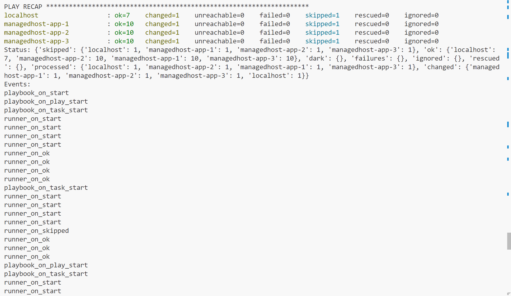

# Author: Maheen Raza
# ENSF 400 - Lab 5 - Ansible

In this assignment, we had to work on extending our lab 5 in order to add nginx as a loader balancer. Out of the three ways we could've done this, I used the localhost approach, where I used Ansible to install the nginx service on the localhost.

## Steps I followed to complete the assignment

### For part 1:

After completing the tasks for lab 5 and successfully pinging our 3 managed hosts, I added in an additional play into the hello.yml playbook to install configure Nginx as a loadbalancer, using the template that was provided to us in the assignment2 directory. I then edited the docker-compose.yml file to define the nginx load balancer service, defining the container volumes and mapping host port to container port as necessary. In our inventory file hosts.yml, I defined the loadbalancer group, where I defined the connection as localhost to make sure that nginx was installed on the localhost as instructed. I also edited the nginx configuration file by mapping the defined port 0.0.0.0 to the appropriate host ports of each managed host (so 3000, 3001 and 3002). After completing these steps, I then ran the playbook using the "ansible-playbook hello.yml" command in order to execute the third new play to download nginx on localhost. After this ran successfully, I ran the command "service nginx status" to check if nginx was running and also the command "curl http://0.0.0.0" and I got the following output:

This confirmed that the loadbalancer was working as expected, and is returning the expected outputs of the backend services I defined in nginx.conf.

### For part 2:

In order to convert the steps of lab 5 into python code, these are the steps I followed:

For the load_inventory.py file, I first used the techniques we learned in lab 1 to open and parse through the hosts.yml file in order to print the groups, their corresponding hosts and their IP addresses and names. Using the ansible python library installation documentation, I used the run_command() helper function to run the command that we used to ping the hosts "ansible all:localhost -m ping" in order to ping the hosts using a python file instead. I then printed out the results. When running the load_inventory.py file, I get this output:

For the run_playbook.py file, I first defined the directories for the playbook yml file and the inventory yml file. Using the ansible python library installation documentation, I used the ansible_runner.run() function to run the playbook by passing in the playbook and hosts inventory file into the function. I also then used the Runner.stats and Runner.events function to print out the results of the execution of the playbook, resulting in the following output:

(I didn't include the entire screenshot since it was way too long)

## Citations:

ansible-runer Documentation. (n.d). Retrieved from
https://ansible.readthedocs.io/projects/runner/en/latest/python_interface/

